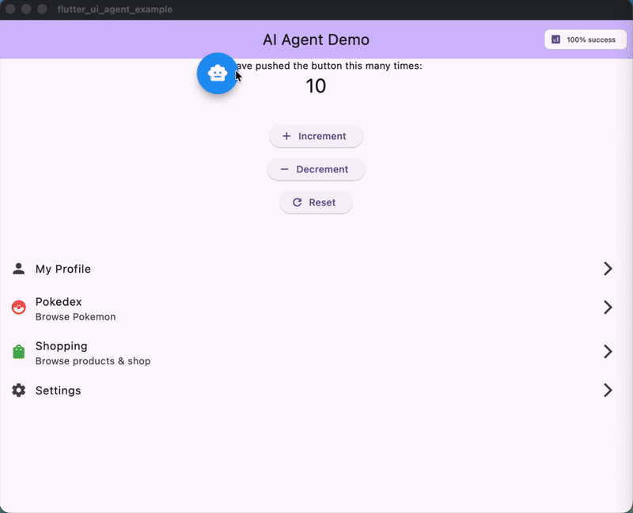

# Flutter UI Agent

[](https://pub.dev/packages/flutter_ui_agent)
[](https://opensource.org/licenses/MIT)

Control your Flutter app with natural language. Let AI agents understand and interact with your UI.

**⚠️ Beta Release** - API may evolve before 1.0 stable release.

---

## What is Flutter UI Agent?

Flutter UI Agent lets users control your app using natural language instead of traditional UI interactions. Wrap your widgets with `AiActionWidget` and they become AI-controllable.

**Example Commands:**
```
"Change my bio to 'Flutter Developer'"
"Find red products and add them to cart"
"Navigate to settings and enable dark mode"
"Increment the counter 5 times"
```

<div align="center">
  
  <p><em>AI Agent controlling a Flutter app with natural language commands</em></p>
</div>

---

## ✨ Features

- 🧠 **LLM-Agnostic** - Works with Gemini, HuggingFace, OpenAI, Claude, or any LLM
- 🎯 **Dynamic Actions** - Wrap any widget to make it AI-controllable
- 🧭 **Smart Navigation** - Automatic page tracking with NavigatorObserver
- ⚡ **Async Support** - Handle navigation and async operations seamlessly
- 🔄 **Multi-Step Commands** - Execute complex action sequences
- 📊 **Analytics** - Track action usage and performance
- 🎨 **Customizable** - Flexible configuration and logging

---

## 🚀 Quick Start

### 1. Installation

```yaml
dependencies:
  flutter_ui_agent: ^0.1.0-beta.1
```

### 2. Create an LLM Provider

Implement the `LlmProvider` interface for your chosen LLM:

```dart
import 'package:flutter_ui_agent/flutter_ui_agent.dart';

class GeminiProvider implements LlmProvider {
  late String apiKey;
  late String modelName;
  
  @override
  Future<void> configure({required String apiKey, String? modelName}) async {
    this.apiKey = apiKey;
    this.modelName = modelName ?? 'gemini-2.0-flash-exp';
  }

  @override
  Future<LlmResponse> send({
    required String systemPrompt,
    required String userMessage,
    required List<Map<String, dynamic>> tools,
    required List<ConversationMessage> history,
  }) async {
    // Call your LLM API here with your chosen SDK
    // Return LlmResponse with functionCalls or text response
  }
}
```

### 3. Setup AgentService

```dart
void main() async {
  final agentService = AgentService();
  final llmProvider = GeminiProvider();
  
  await llmProvider.configure(
    apiKey: 'YOUR_API_KEY',
    modelName: 'gemini-2.0-flash-exp',
  );
  
  agentService.setLlmProvider(
    llmProvider,
    config: const AgentConfig(
      logLevel: AgentLogLevel.info,
      enableAnalytics: true,
      debugMode: true,
    ),
  );

  runApp(
    AgentHost(
      agentService: agentService,
      child: MyApp(),
    ),
  );
}
```

### 4. Make Widgets AI-Controllable

```dart
AiActionWidget(
  actionId: 'increment_counter',
  description: 'Increment the counter by 1',
  onExecute: () {
    setState(() => counter++);
  },
  child: ElevatedButton(
    onPressed: () => setState(() => counter++),
    child: Text('Increment'),
  ),
)
```

### 5. Add Navigation Tracking

```dart
MaterialApp(
  navigatorObservers: [
    AgentNavigatorObserver(agentService),
  ],
  // ...
)
```

### 6. Process User Commands

```dart
await agentService.processUserMessage('Increment the counter 5 times');
```

---

## 🎯 Example Prompts

Try these natural language commands in your app:

**Simple Actions:**
- "Increment counter 5 times"
- "Set counter to 100"
- "Reset counter"

**Navigation + Actions:**
- "Go to settings and enable dark mode"
- "Navigate to profile and change my bio to 'Flutter Developer'"
- "Open shopping page and search for shoes"

**Multi-Step:**
- "Set counter to 50, increment 10 times, then go to profile"
- "Go to settings, enable dark mode, then go to shopping"

**Natural Language:**
- "Can you increase the counter by 7?"
- "I want to see my profile"
- "Turn off notifications and update my status"

See the [example app](example/) for a complete demo with shopping, profile, and settings pages.

---

## ⚠️ Important: Safety & Limitations

**This package is experimental and should be used with caution in production environments.**

### Safety Guidelines

🚫 **DO NOT use for sensitive operations without user confirmation:**
- Payment processing (NO automatic payments)
- Financial transactions
- Data deletion
- Security-critical actions

✅ **SAFE use cases:**
- Generate summaries for user review
- Create draft content for approval
- Assist with form filling (with confirmation)
- Navigate and display information
- Filter and search data

**Best Practice:** For sensitive operations, use AI to **prepare** the action (e.g., calculate total, create order summary), then require explicit user confirmation before execution.

**Example - Safe Payment Flow:**
```dart
// ✅ GOOD: AI prepares, user confirms
AiActionWidget(
  actionId: 'prepare_checkout',
  description: 'Prepare checkout summary for user review',
  onExecuteWithParams: (params) {
    // AI calculates total, applies discounts, etc.
    showCheckoutSummary(); // User must tap "Confirm Payment" button
  },
)

// ❌ BAD: Direct payment automation
AiActionWidget(
  actionId: 'process_payment',  // NEVER DO THIS
  description: 'Process payment immediately',
  onExecute: () => processPayment(), // Dangerous!
)
```

---

## 📖 Core Concepts

### AiActionWidget

Wraps any widget to make it AI-controllable:

```dart
// Simple action
AiActionWidget(
  actionId: 'like_post',
  description: 'Like the post',
  onExecute: () => likePost(),
  child: IconButton(icon: Icon(Icons.favorite)),
)

// Action with parameters
AiActionWidget(
  actionId: 'update_bio',
  description: 'Update user bio text',
  parameters: {'bio_text': 'string'},
  onExecuteWithParams: (params) {
    final bio = params['bio_text'] as String;
    updateBio(bio);
  },
  child: TextField(),
)

// Async action
AiActionWidget(
  actionId: 'navigate_settings',
  description: 'Navigate to settings page',
  onExecuteAsync: () async {
    Navigator.pushNamed(context, '/settings');
    await Future.delayed(Duration(milliseconds: 100));
  },
  child: ListTile(title: Text('Settings')),
)
```

### AgentService

Central service managing AI actions:

```dart
// Process commands
await agentService.processUserMessage('your command');

// Cancel in-progress requests
agentService.cancelCurrentRequest();

// Access statistics
final stats = agentService.statistics;
print('API Calls: ${stats['apiCalls']}');
print('Success Rate: ${stats['successRate']}%');

// Get current page
print('Current page: ${agentService.currentPage}');

// Clear conversation history
agentService.clearHistory();
```

### Navigation Tracking

Track page changes automatically:

```dart
MaterialApp(
  navigatorObservers: [
    AgentNavigatorObserver(agentService),
  ],
  onGenerateRoute: (settings) {
    // Your routing logic
  },
)
```

---

## ⚙️ Configuration

### AgentConfig Options

```dart
AgentConfig(
  // Logging
  logLevel: AgentLogLevel.info,  // none, error, warning, info, verbose, debug
  useEmojis: true,
  logPrefix: '[FlutterUIAgent]',
  
  // Behavior
  enableRetry: true,
  maxRetries: 3,
  retryBackoffStrategy: RetryBackoffStrategy.exponential,
  retryBaseDelayMs: 1000,
  
  // History & Analytics
  enableHistory: true,
  maxHistoryLength: 10,
  enableAnalytics: true,
  onActionExecuted: (actionId, duration) {
    print('$actionId took ${duration.inMilliseconds}ms');
  },
  
  // Development
  debugMode: true,
  fallbackToMock: false,
)
```

### Log Levels

| Level | Use Case | Output |
|-------|----------|--------|
| `none` | Production (silent) | No logs |
| `error` | Production (errors only) | Errors only |
| `warning` | Production (important) | Errors + warnings |
| `info` | Default | Errors + warnings + info |
| `verbose` | Development | All above + verbose details |
| `debug` | Debugging | Everything including debug info |

---

## 🎯 Example App

Check out the `example/` folder for a complete demo featuring:

- **Counter Page** - Simple increment/decrement actions
- **Profile Page** - Bio and status updates
- **Data Browser** - Search and filtering
- **Shopping Page** - Product browsing and cart management
- **Settings Page** - Theme and configuration changes
- **Floating Chat UI** - Natural language command interface

**Run the example:**

```bash
cd example
cp lib/app/config/app_config.dart.example lib/app/config/app_config.dart
# Add your API key to app_config.dart
flutter run
```

**Try these commands in the example:**
```
"Increment counter 3 times"
"Change my bio to 'Flutter enthusiast'"
"Find red products"
"Navigate to settings and enable dark mode"
"Add running shoes to cart"
```

---

## 🤖 Tested AI Models

These models have been tested and work well with Flutter UI Agent:

### Gemini (Google)
```dart
modelName: 'gemini-2.0-flash-exp'  // Fast, reliable
```

### HuggingFace
```dart
modelName: 'Qwen/Qwen3-235B-A22B-Instruct-2507'  // High quality, open-source
```

### Bring Your Own
Implement `LlmProvider` for any LLM with function calling support (OpenAI GPT-4, Claude, etc.)

---

## 🛠️ Advanced Usage

### Custom System Prompts

```dart
agentService.setSystemPrompt('''
You are a helpful assistant for a shopping app.
Focus on helping users find and purchase products.
Be concise and action-oriented.
''');
```

### Mock Mode (Testing)

Test without API keys:

```dart
// Don't call setLlmProvider()
// AgentService will use keyword-based matching
await agentService.processUserMessage('increment counter');
```

### Error Handling

```dart
try {
  await agentService.processUserMessage('your command');
} catch (e) {
  print('Command failed: $e');
  // Handle error
}
```

### Dynamic Action Registration

```dart
// Actions are automatically registered when AiActionWidget builds
// Access all registered actions:
final actions = agentService.actions;
print('Available actions: ${actions.keys}');
```

---

## 📊 Analytics & Monitoring

### Track Performance

```dart
AgentConfig(
  enableAnalytics: true,
  onActionExecuted: (actionId, duration) {
    analytics.logEvent(
      name: 'ai_action',
      parameters: {
        'action_id': actionId,
        'duration_ms': duration.inMilliseconds,
      },
    );
  },
)
```

### View Statistics

```dart
final stats = agentService.statistics;
print('Total API calls: ${stats['apiCalls']}');
print('Failed calls: ${stats['failures']}');
print('Success rate: ${stats['successRate']}%');
```

---

## 🔒 Security Best Practices

### 1. Never Commit API Keys
```dart
// ✅ Good: Use environment variables or secure storage
apiKey: Platform.environment['GEMINI_API_KEY']

// ❌ Bad: Hardcoded in source
apiKey: 'actual-api-key-here'
```

### 2. Use `.gitignore`
```gitignore
**/app_config.dart
**/*.env
```

### 3. Validate AI Actions

**Always validate and sanitize parameters before executing actions:**

```dart
AiActionWidget(
  actionId: 'update_profile',
  parameters: {'bio': 'string'},
  onExecuteWithParams: (params) {
    final bio = params['bio'] as String;
    
    // ✅ Validate input
    if (bio.length > 500) {
      throw Exception('Bio too long');
    }
    if (_containsProfanity(bio)) {
      throw Exception('Invalid content');
    }
    
    updateBio(bio);
  },
)
```

### 4. Require Confirmation for Sensitive Actions

**Never allow AI to directly execute:**
- Payments or purchases
- Account deletion
- Password changes
- Data exports
- Sharing private information

**Instead, use a confirmation flow:**

```dart
// AI prepares the action
AiActionWidget(
  actionId: 'prepare_delete_account',
  description: 'Show account deletion confirmation dialog',
  onExecute: () {
    showDialog(
      context: context,
      builder: (context) => AlertDialog(
        title: Text('Delete Account?'),
        content: Text('This action cannot be undone.'),
        actions: [
          TextButton(
            onPressed: () => Navigator.pop(context),
            child: Text('Cancel'),
          ),
          TextButton(
            onPressed: () {
              _actuallyDeleteAccount(); // User explicitly confirmed
              Navigator.pop(context);
            },
            child: Text('Delete'),
          ),
        ],
      ),
    );
  },
)
```

### 5. Rate Limiting

Implement rate limiting to prevent abuse:

```dart
// Limit AI requests per user/session
class RateLimiter {
  final _timestamps = <DateTime>[];
  final maxRequests = 10;
  final timeWindow = Duration(minutes: 1);
  
  bool allowRequest() {
    final now = DateTime.now();
    _timestamps.removeWhere(
      (t) => now.difference(t) > timeWindow,
    );
    
    if (_timestamps.length >= maxRequests) {
      return false; // Rate limit exceeded
    }
    
    _timestamps.add(now);
    return true;
  }
}
```

### 6. Log and Monitor

Track all AI actions for security auditing:

```dart
AgentConfig(
  enableAnalytics: true,
  onActionExecuted: (actionId, duration) {
    securityLog.record(
      action: actionId,
      timestamp: DateTime.now(),
      userId: currentUser.id,
      duration: duration,
    );
  },
)
```

---

## 🤝 Contributing

Contributions are welcome! Please feel free to submit a Pull Request.

1. Fork the repository
2. Create your feature branch (`git checkout -b feature/amazing-feature`)
3. Commit your changes (`git commit -m 'Add amazing feature'`)
4. Push to the branch (`git push origin feature/amazing-feature`)
5. Open a Pull Request

---

## 📄 License

This project is licensed under the MIT License - see the [LICENSE](LICENSE) file for details.

---

## 🔗 Links

- [GitHub Repository](https://github.com/MAUstaoglu/flutter_ui_agent)
- [Issue Tracker](https://github.com/MAUstaoglu/flutter_ui_agent/issues)
- [pub.dev](https://pub.dev/packages/flutter_ui_agent)

---

## 💬 Support

- **Issues**: [GitHub Issues](https://github.com/MAUstaoglu/flutter_ui_agent/issues)
- **Discussions**: [GitHub Discussions](https://github.com/MAUstaoglu/flutter_ui_agent/discussions)

---

Made with ❤️ for the Flutter community

